<!-- _class: invert -->
<!-- _paginate: false -->
# F1 doesn't matter
## 👨‍🚀 ... and other stories from **the industry**
> **Murhaf Fares** (he/him)
> **Emanuele Lapponi** (he/him)
> Machine intelligence @Fremtind


---
## 🤔 Who are you?

- LTG PhD class of 2019
- Worked on NLP most of our professional lives
- Mostly together 🤗

---
## 🤔 What's a Fremtind

- One of Norway's leading insurance companies, owned by SB1 and DNB
- Data is at the core of most insurance processes


---
## 📝 Coming up in this talk

```
~/talks/f1-doesnt-matter  main ✔                                                   0m
▶ cat slides.md | grep "^# \*\*"
# **Quick NLP hacks can have a big impact**
# **Visualize all the things**
# **On customer satisfaction and feedback**
# **A simple model is enough**
# **Make the most of small data**
# **F1 doesn't matter**
# **Budget UI is better than no UI**
# **Model management is hard**
# **The world beyond NLP and deep learning**
# **Being cool always beats raw technical prowess**
```

---
<!-- _class: invert -->
# **Quick NLP hacks can have a big impact**
##### <!-- fit --> 🦟 Or: Don't kill a mosquito with a bazooka


---

**Task**: Given a "tell us what happened"-description, find out whether the travel destination is in Norway, Europe, or in the rest of the world

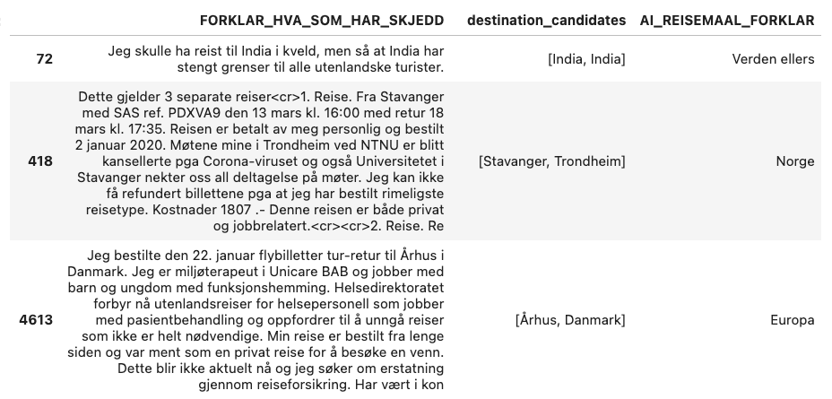

---
**What worked:**
- Some off-the-shelf preprocessing with Spacy 💝
- Fuzzy matching against a knowledge-base of places

###### **~2000 claims automated 💰**


---
<!-- _class: invert -->
# **Visualize all the things**
🗺️ **Seeing is believing**


---
- We work with a bunch of different datasets
- Some neural representations might be better than other
- Some might be cheaper
- What's a representation anyway? It's important to "build trust" across teams and customers. "Seeing is believing"

# <!-- fit -->🎨 One thing we do all the time: Embed, reduce, scatter

---
```python
import altair as alt
from umap import UMAP

two_d = UMAP().fit_transform(df["embeddings"])
df["x"], df["y"] = two_d[:, 0], two_d[:, 1]

alt.Chart(df).mark_circle(size=60).encode(
    x='x',
    y='y',
    tooltip=["text"]
).properties(width=1000, height=500).interactive()

```

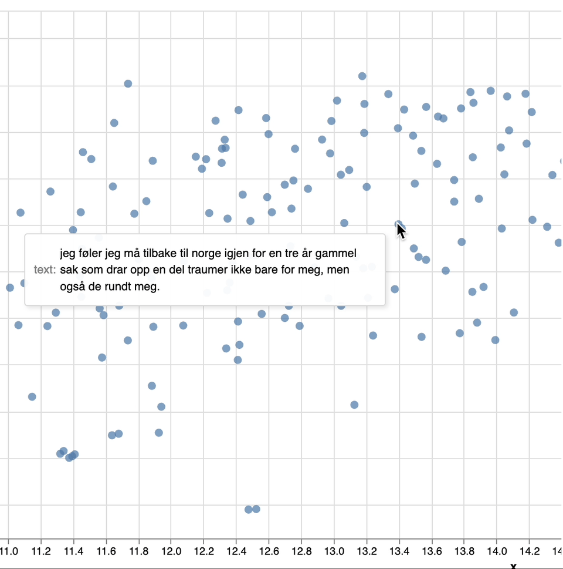

---
<!-- _class: invert -->
# **On customer satisfaction and feedback**
# <!-- fit -->  😱 Or: Not all bad feedback is interesting

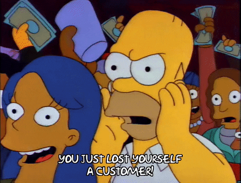

---
**Customer surveys** are an important tool to improve processes in most product companies. At Fremtind, customers have the opportunity to give us written feedbacks at different steps of their journey: as they **purchase** new insurances, **update/upgrade/review** their coverage, and, perhaps most interestingly for our business, **after a claim has been approved or rejected** (some 50K a year.)


---
"Vanilla" sentiment analysis is not necessarily useful to analyze and extract value from these written messages: Most feedbacks come pre-equipped with a 🎲 or a 👍/👎.

At the same time, these user generated scoring systems are useful to take the general temperature of customer satisfaction, but fall short at providing a ranking of feedbacks that are relevant to address different business problems.

# <!-- fit --> So how can we use customer feedback to improve customer satisfaction?

---
## Facts:
There are 3 key drivers for CS in insurance: (1) being paid, (2) being paid quickly, (3) clarity and respect in the claim process.

For (1), there is just not much we can do to improve: the damage is either covered or it isn't. For (2), well, we know. We either hire more temps in dire times, or some people are just going to have to be patient.

#### For **(3)**, we decided that absolutely all customers should be met with clear language and a high level of empathy and understanding.

##### **The degrees to which a given message is about unclear language, or whether the customer was met with impatience and/or antagonism become interesting dimensions.**

---
# 🧙‍♀️ Mana

In this project, we score customer feedback and other interactions from a variety of sources with the degree to which they pertain different (relevant) aspects of communication. This enables our (hundreds of) colleagues to **read more relevant messages** and use **text scores as quantities for their KPIs**.

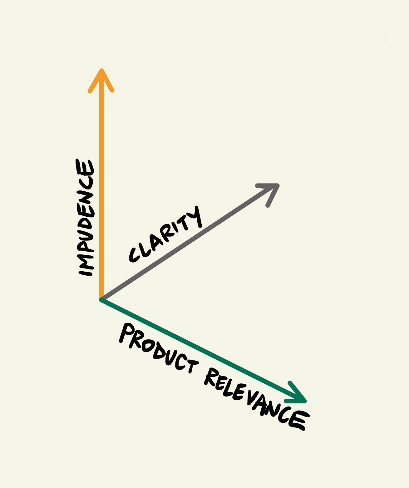

---
<!-- _class: invert -->
# **A simple model is enough**
😎 **Or: how I learned how to stop worrying and just throw some pretrained embeddings at a dense layer**
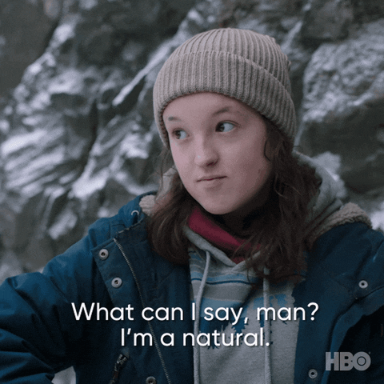

---
- Each of the aforementioned dimensions translates to a simple text classification problem 
- Supervised learning: a training set of pairs (text, relevant/irrelevant)
- We train a simple feedforward neural network with input representation from sentence transformers (e.g., Bert, Universal Sentence Encoders, etc...)
- Shoutout `https://huggingface.co/NbAiLab/nb-sbert-base`! 🙌

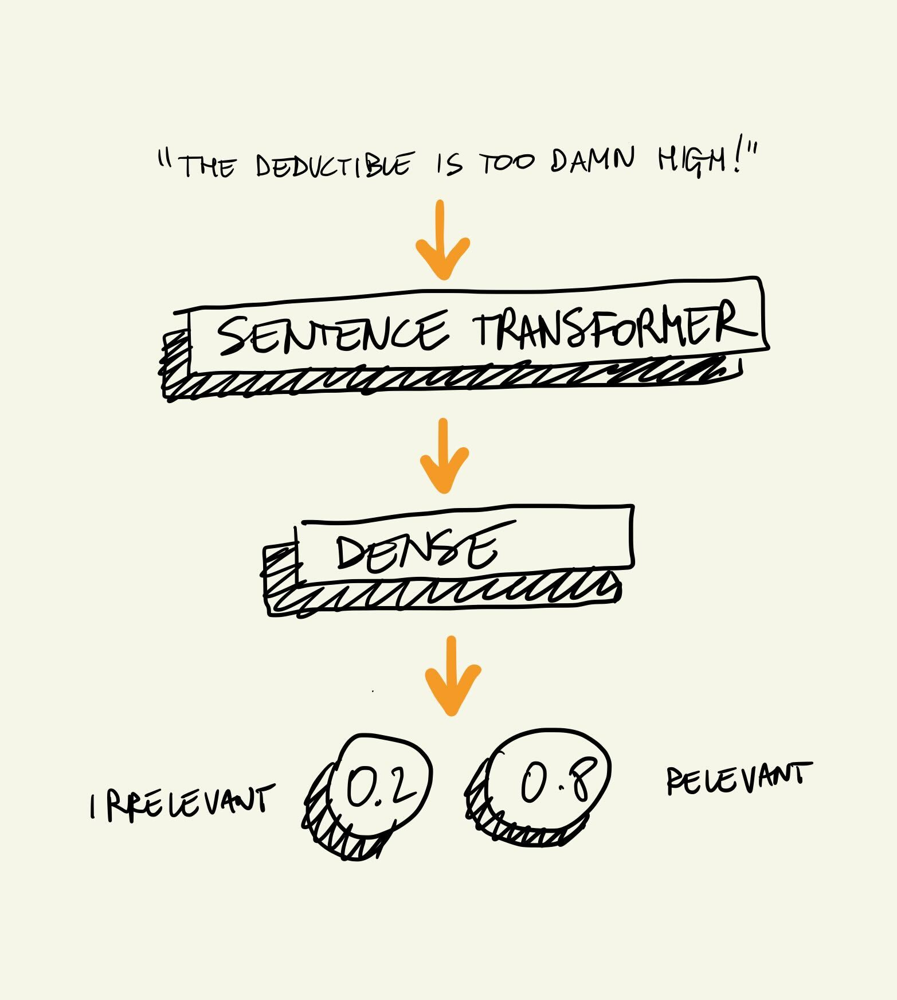

---
### <!-- fit --> **Topic classification for customer feedbacks**

- Find extra (textual) features such as the URL of the page on which the customer wrote their feedback
- Preprocess the URL and embed it
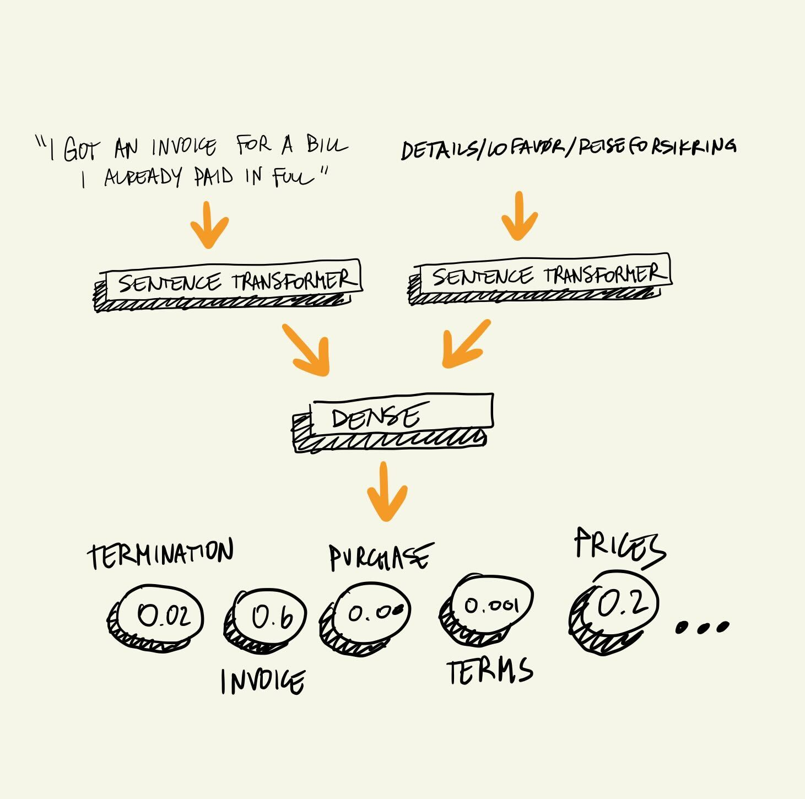

---
### **Transfer learning**
- We have different models for different teams
- Each team define their own categories, but those overlap
- This can be exploited by simply initializing the model weights in model B using weights from model A
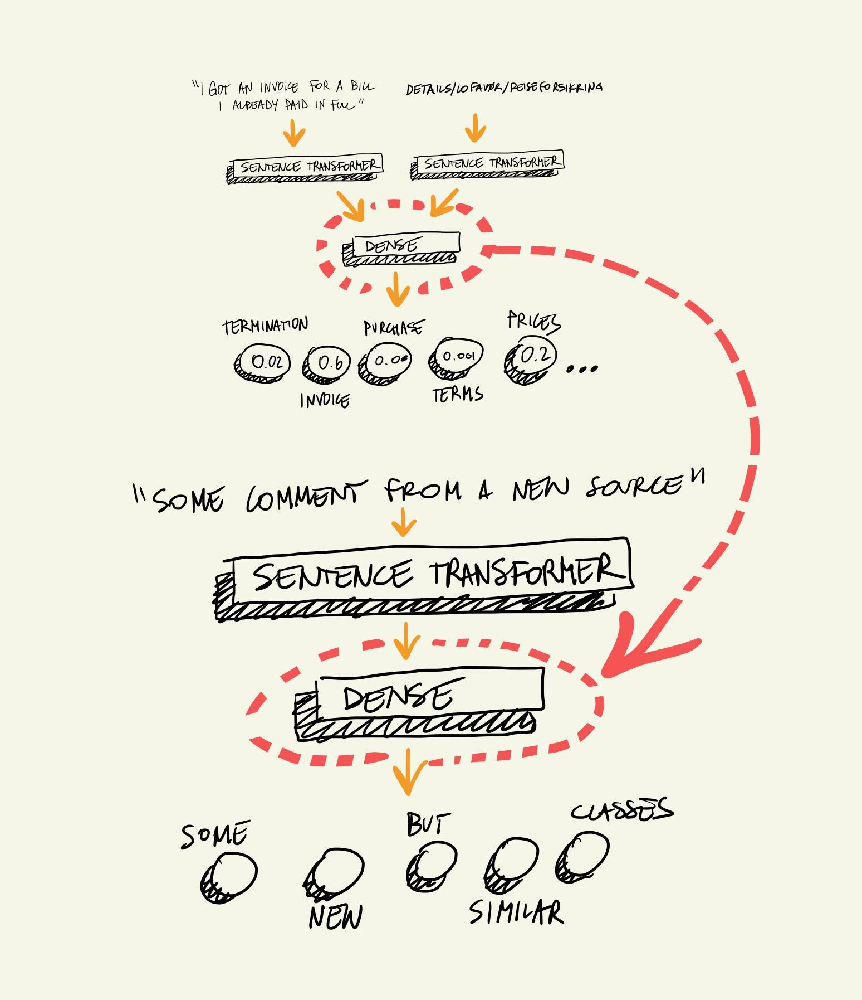

---
## <!-- fit --> **Building the model is only one piece of the puzzle, though**
- Text preprocessing is a must regardless of how good your embeddings are
- For example, anonymization: no consumer data should leak into training data
## Look at your data, again and again 🧐
→ Don't sleep on embed/reduce/scatter!

---
#  **Serving the models**

- REST API in a microservice 
- Scheduled tasks: fetch the data every day/week/month, score it and write it back


---
<!-- _class: invert -->
# **Make the most of small data**
🤬 **Or: nobody is going to like you if you constantly ask people to annotate data for you**


---
## Problem: We need **classification** models for **clarity**
... but we have no data

Instead of asking people to annotate more data, can we pick their brains about how they would annotate the data and use that expertise somehow?

---
#### _Thank god for_
### <!--fit --> **Weak Supervision!**
- (Re)use existing sentiment dataset to create new datasets for clarity and impudence
- Translate their expertise to labelling functions to produce so-called silver data $(𝑋,\widetilde Y)$

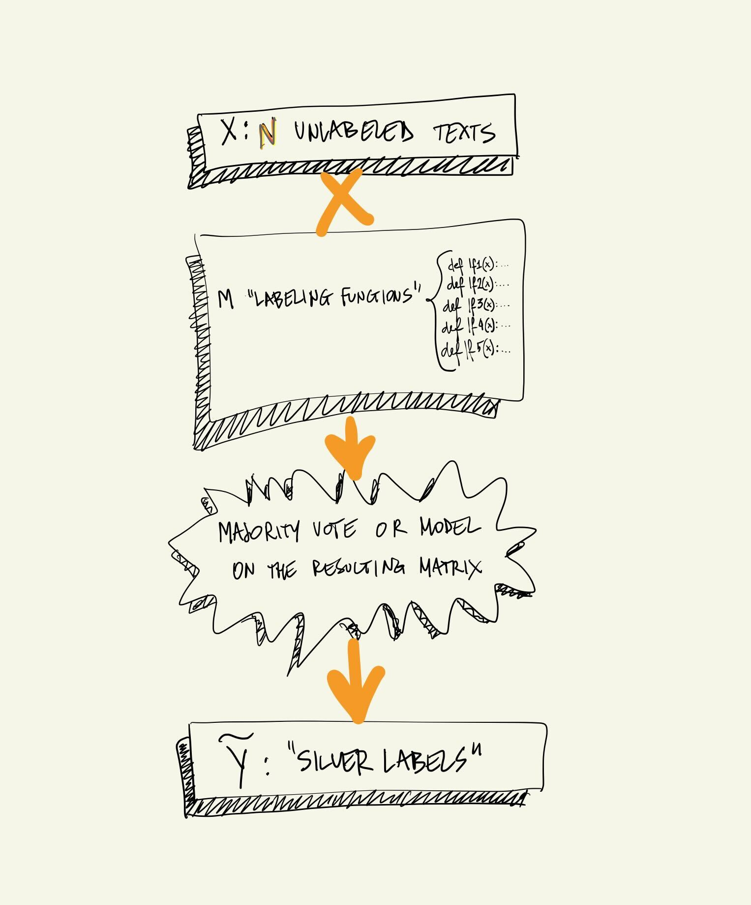

--- 
# 🤿 Labeling  functions can be as simple as:

```python
def lf_short_message_positive(x):
    if len(x.doc) < 5 and x.sentiment_score < 0.4:
        return 0
    return -1

def lf_contains_one_strong_and_negative(x):
    if x.sentiment_score >= 0.5 and contains_word(x.doc, ASSETS["UNCLARITY"]["strong"]) :
        return 1
    return -1

def lf_six_and_positive(x):
    if x.sentiment_score < 0.5 and x[dice_col_unc] == 6:
        return 0
    return -1
```

---
<!-- _class: invert -->
# **F1 doesn't matter**
💖 **Or: does it spark joy?**

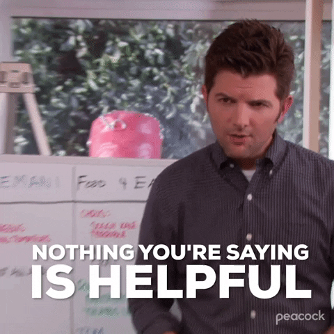

---
- F1 _does_ matter, but it is not the only metric we consider
- What is a _good_ model, anyway?
- What is good enough when we are limited by time and resources?

---
# F1 **doesn't matter**
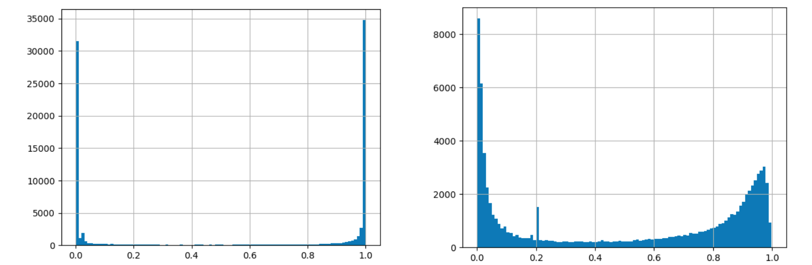

---
### <!-- fit --> Qualitative is as important as quantitative 🍒
- Short feedback messages tend to be positive, whereas longer ones fall more on the negative side
- A recurrent neural network could learn that
- Would the model output still be interesting? Depends on how it will be used 
## **Think about the consumers of the model output** 🛍️

---
#### <!-- fit --> Friends don't let friends obsess on hyperparameter tuning
- Simplicity, efficiency vs improving F1 by 0.1 
- No point in e.g. spending a lot of resources and time on fine-tuning a Bert, if vanilla works well enough
- Hp-tuning is a waste of time if you don't like what comes out of the model

#### <!-- fit --> **Simple/fast/not clunky is almost always more valuable than a few percentage points** 💰

---
## 🛠️ Tradeoffs of the trade 
- Precision and/or recall, at thresholds!
- Sometimes a bad model is better than no model at all 
- Can we tweak the system implementation so that false positives don't matter as much?

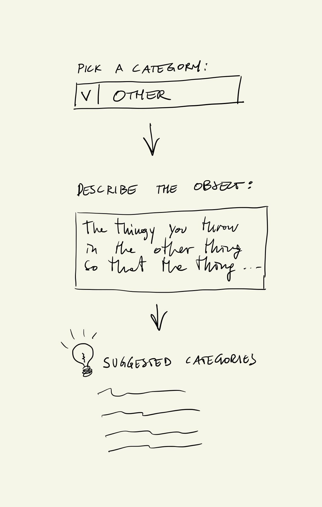

---
<!-- _class: invert -->
# **Budget UI is better than no UI**
🎨 **Or: unleash your inner frontend dev**


---
🔥 **Hot take**

# <!-- fit --> An interactive demo is worth more than a better model, 100 excel sheets or 1000 reports

`https://streamlit.io/`

→ cmd-tab to Cura

---
<!-- _class: invert -->
# **Model management is hard**
🎨 **Don't do it (yourself)**


---
Long story short: you gotta keep track of models, data, model versions, val/test splits, evaluation plots, comments, and more.

# <!-- fit --> You are **not** going to be able to do it (well) for yourself, let alone a whole team

We use `https://github.com/mlflow/mlflow/`

→ cmd-tab to ml-flow

---
<!-- _class: invert -->
# **The world beyond NLP and deep learning**
🚪 **Tabular data, for example**


---
# 🧁 Muffins

- A system that produces a score to reflect 'problematic' customer profiles
- Trained on e.g. fraud
- Working with tabular data, gradient boosting and feature engineering is satisfying ✨
- A viper's nest of potential ethical pitfalls; explainable AI is a **MUST**

→ Check out: 
`https://medium.com/fremtind/forsikring-og-muffens-fa2e8cfbca5b`
`https://github.com/odaon/muffins-ai-motor`

---
#  Putting a system in production is an art in itself 🌎

Some call it **MLOps**

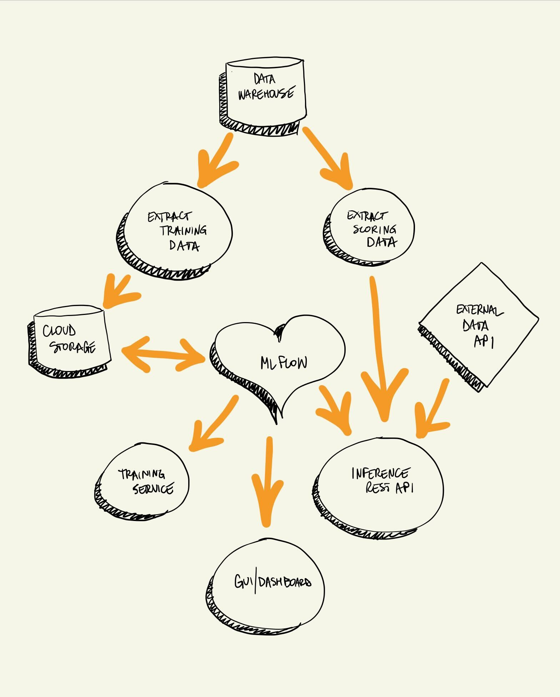

---
<!-- _class: invert -->
# **Being cool always beats raw technical prowess**
🤝 **Or: be a bud**


---
### Some things we have seen
- Dropping model names like you are swapping pokemon cards
- Gatekeeping and arrogance
- Toxic code reviews
- Now that every linkedin influencer is a ChatGPT expert, it's easy to forget that NLP is hard.

##### **Empathy and willingness to learn and share make more ML money than hard skills**


---
# Thank you!
###  Questions?
